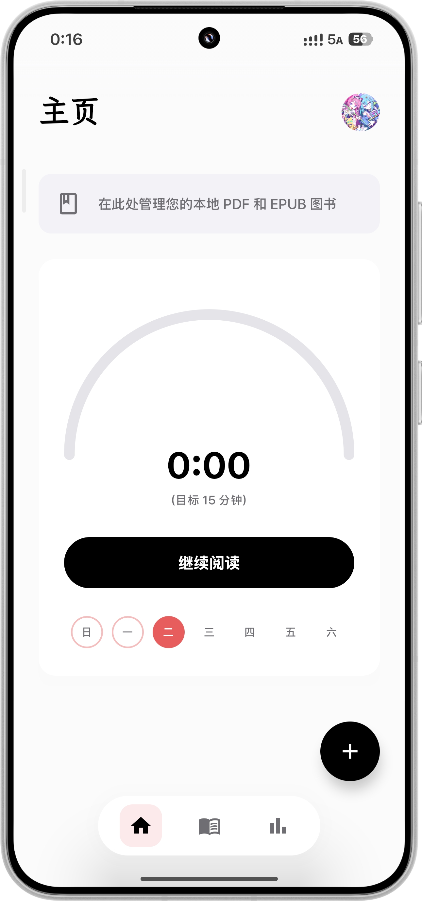

<!-- Language: ko | Audience: user -->

🌐 [中文](README.md) · [English](README.en.md) · [日本語](README.ja.md) · **한국어**

📖 **사용자 가이드** · [⚙️ 개발자 문서](README.dev.ko.md)

---

# Lumi — 독서를 위해 태어나다

> 깔끔하고 우아한 Android 로컬 전자책 리더. EPUB, PDF, TXT 지원. 개인정보 보호 최우선, 완전 오프라인.

  

---

## ✨ 기능

### 📖 독서 경험
- EPUB, PDF, TXT 세 가지 형식 지원
- **EPUB 듀얼 렌더링 모드**：북 레이아웃（출판사 HTML/CSS/글꼴 유지）+ 리더 레이아웃（통일된 타이포그래피）
- Canvas + StaticLayout 자체 렌더링 엔진, 부드러운 페이지 넘김 애니메이션
- **네 가지 페이지 넘김 효과**：슬라이드, 스크롤, 페이드, 컬（실제 책장 넘김 시뮬레이션）
- **Bionic Reading（바이오닉 리딩）**：단어 앞부분을 굵게 표시하여 읽기 속도와 집중력 향상
- 다양한 읽기 테마（낮 / 밤 / 세피아 / 그린 + 사용자 지정 색상）
- 세밀한 타이포그래피 설정（글꼴 크기, 줄 간격, 자간, 문단 간격, 4면 독립 여백, 들여쓰기）
- 사용자 지정 텍스트 색상 및 배경（HSL 색상 선택기 + 갤러리 사진）
- **사용자 지정 글꼴**：내장 LXGW WenKai, Fangsong, Kaiti + 개인 글꼴 가져오기（.ttf）
- 스마트 제스처 시스템（좌우 탭으로 페이지 넘김, 중앙 탭으로 메뉴, 드래그로 페이지 넘김）
- 볼륨 키 페이지 넘김（방향 설정 가능）
- 모서리 정보 표시 사용자 지정（챕터 / 진행률 / 페이지 번호 / 배터리）
- **중국어 간체/번체 변환**：책별로 원문 / 간체 / 번체 전환
- 화면 시간 제한 재정의（읽는 동안 화면 켜짐 유지）

### 🎧 TTS & 오디오북
- 시스템 TTS 엔진 통합
- **서드파티 TTS API 지원**：OpenAI 호환 TTS, Xiaomi MiMo Chat TTS
- 스트리밍 오디오 캐시（자동 정리 한도 설정 가능）
- 포그라운드 서비스 + 알림 제어（재생 / 일시정지 / 이전 문장 / 다음 문장）

### ✨ 텍스트 선택 & 주석
- Android 네이티브 텍스트 선택 + 사용자 지정 Compose 플로팅 메뉴
- 6색 하이라이트（탭하여 보기 및 색상 변경）
- 하이라이트 텍스트에 연결된 노트
- 전체 텍스트 검색（깜빡이는 하이라이트 표시）
- 책갈피：추가 / 삭제 / 빠른 이동
- **주석 내보내기**（책갈피 + 하이라이트 + 노트）

### 📚 책장 관리
- 로컬 파일 가져오기（시스템 파일 선택기 + 책 폴더 권한 부여, 복사 불필요）
- 자동 추출 책 표지（Coil 이미지 로딩）
- **전체 텍스트 검색**：전체 라이브러리 검색
- **사용자 지정 태그**：책 분류용
- 사용자 지정 표지（갤러리에서 선택）
- 책 메타데이터 편집（제목, 저자）
- 즐겨찾기 / 삭제 관리
- 길게 누르기 컨텍스트 메뉴（글래스모피즘 오버레이）

### 📊 독서 통계
- 오늘의 독서 시간 + 주간 트렌드
- 사용자 지정 가능한 일일 독서 목표
- 주 / 월 / 연도 탭 네비게이션
- 월간 히트맵（달력 그리드, 독서 시간별 색상）
- 연간 히트맵（GitHub 기여 그래프 스타일, 53×7 Canvas 렌더링）
- 주간 막대 그래프
- 연속 독서 일수 기록

### ☁️ 클라우드 동기화 & 백업
- **WebDAV 클라우드 동기화**：책, 독서 진행률, 노트, 책갈피를 개인 WebDAV 서버에 수동 또는 자동 동기화
- 연결 테스트 + 마지막 동기화 시간 표시
- **로컬 백업 및 복원**（ZIP 내보내기/가져오기：데이터베이스 + DataStore + 표지 + 책）
- 저장 공간 사용량 시각화

### 🎨 테마 & 외관
- **세 가지 앱 테마**：기본（테마 색상 변경 가능, 초기 색상은 Lumi 핑크）, Material 3（다이나믹 컬러）, Liquid Glass（리퀴드 글래스）
- Liquid Glass：투명도 조절 + HDR 터치 하이라이트
- 다크 모드（시스템 연동 / 라이트 / 다크）
- Motion Pro 애니메이션（베타）
- 선택적 스플래시 화면
- 예측형 뒤로 가기 제스처 지원
- UI 요소 전환 애니메이션
- **다국어 지원**：7개 로케일 — 중국어 간체, 중국어 번체(중국 타이완), 중국어 번체(중국 홍콩), 중국어 번체(중국 마카오), English, 日本語, 한국어

### ⚙️ 스마트 PDF 처리
- **로컬 추출**：기기 내 PDF 텍스트 레이어 추출（스캔 PDF 미지원）
- **MinerU 클라우드 파싱**（서드파티 서비스）：
  - 라이트 모드：무료, 토큰 불필요, 최대 10MB / 20페이지
  - 정밀 모드：개인 토큰 필요, 최대 200MB / 200페이지, VLM 구동
  - 수동 모드：MinerU 웹사이트에서 처리 후 ZIP/Markdown 가져오기
- PDF를 리플로우 가능한 전자책으로 변환하여 통일된 독서 경험 제공

### 🔒 개인정보 보호
- **로컬 우선** — 업데이트 확인 시에만 GitHub 서버에 연결, 개인정보 전송 없음
- **서드파티 SDK 제로** — 분석, 광고, 푸시 알림, 크래시 보고 없음
- **Android 샌드박스 저장소** — 모든 데이터는 앱 전용 디렉터리에만 저장
- **오픈소스, 감사 가능** — 전체 소스 코드 공개, 누구나 검토 가능
- 첫 실행 시 개인정보 처리방침 및 이용약관 표시, 투명한 고지
- 민감 정보（WebDAV, TTS API 키）는 Android KeyStore로 암호화 저장

---

## 📥 다운로드

[GitHub Releases](https://github.com/huangder/Lumi_Books/releases)에서 최신 APK를 다운로드하세요.

---

## 📄 변경 이력

[변경 이력](https://huangder.top/changelog.html)을 확인하세요.

---

## ⭐ 스타 기록

  

---

## 📜 라이선스

Lumi의 오리지널 코드는 [MIT License](LICENSE)에 따라 오픈소스로 공개됩니다. 서드파티 종속성 및 개작 코드는 각각의 라이선스를 따릅니다. Liquid Glass 구현은 Apache 2.0 라이선스의 [AndroidLiquidGlass / Backdrop](https://github.com/Kyant0/AndroidLiquidGlass)을 개작하여 사용합니다. © 2026 Huangder

---

## 🔗 링크

- 🌐 웹사이트：[huangder.top](https://huangder.top)
- 📦 GitHub：[github.com/huangder/Lumi_Books](https://github.com/huangder/Lumi_Books)
- 📧 이메일：huangder0104@126.com

---

  좋은 책에는 좋은 리더가 어울립니다.

