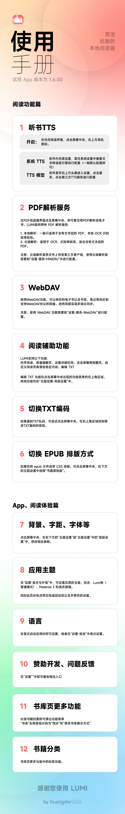

<!-- Language: zh | Audience: user -->

🌐 **中文** · [English](README.en.md) · [日本語](README.ja.md) · [한국어](README.ko.md)

📖 **用户版** · [⚙️ 开发者版](README.dev.md)

---

# Lumi — 为阅读而生

> 简洁优雅的 Android 本地电子书阅读器，支持 EPUB、PDF、TXT 格式。隐私优先，本地优先。

  
   👆 点击查看完整使用手册

---

## ✨ 功能特性

### 📖 阅读体验
- 支持 EPUB、PDF、TXT 三种主流电子书格式
- **EPUB 双渲染模式**：书版布局（保留出版方 HTML/CSS/字体）+ 阅读器布局（统一点阵排版）
- Canvas + StaticLayout 自研渲染引擎，流畅的多种翻页动画
- **四种翻页效果**：平滑滑动、连续滚动、淡入渐变、仿真翻页（Curl）
- **Bionic Reading 仿生阅读**：加粗单词前缀，提升阅读速度与专注力
- 多套阅读主题（白天 / 夜间 / 护眼纸色 / 墨绿 + 自定义颜色）
- 精细排版调节（字号、行距、字间距、段间距、四边独立页边距、首行缩进）
- 自定义文字颜色与阅读背景色（HSL 拾色器 + 相册图片）
- **自定义字体**：内置霞鹜文楷、仿宋、楷体 + 导入个人字体（.ttf）
- 智能手势系统（左右点击翻页、中间唤出菜单、拖拽跟手翻页）
- 音量键翻页（可配置方向）
- 阅读页四角信息区自定义显示（章节 / 进度 / 页码 / 电量）
- **简繁转换**：单本书内一键切换原文 / 简体 / 繁体
- 屏幕超时覆盖（阅读时不熄屏）

### 🎧 TTS 听书
- 系统 TTS 引擎调用
- **第三方 TTS API 支持**：OpenAI 兼容 TTS、小米 MiMo Chat TTS
- 流式音频缓存，可配置自动清理上限
- 前台服务 + 通知栏控制（播放 / 暂停 / 上句 / 下句）

### ✨ 文字选择与标注
- Android 原生文字选择 + 自定义 Compose 浮动菜单
- 6 色高亮标注，支持点击查看和修改颜色
- 添加笔记（关联高亮文本）
- 全文搜索定位 + 复制
- 书签添加 / 删除 / 快速跳转
- **标注导出**（书签 + 高亮 + 笔记）

### 📚 书架管理
- 本地文件导入（系统文件选择器 + 书库文件夹授权，无需拷贝）
- 书籍封面自动提取与展示（Coil 图片加载）
- **全文搜索**：跨书库检索
- **自定义标签**：为书籍添加分类标签
- 自定义封面（从相册选取）
- 自定义书籍信息（书名、作者）
- 收藏 / 删除管理
- 长按书籍唤出玻璃态菜单

### 📊 阅读统计
- 今日阅读时长 + 本周趋势
- 每日阅读目标（完全自定义时长 + 开关）
- 周 / 月 / 年三 Tab 导航
- 月热力图（日历网格，按阅读时长着色）
- 年热力图（GitHub 贡献图风格，53 列 × 7 行 Canvas 渲染）
- 周柱状图
- 连续阅读天数（连胜记录）

### ☁️ 云同步与备份
- **WebDAV 云同步**：手动或自动同步书籍、阅读进度、笔记、书签到自建 WebDAV 服务器
- 连接测试 + 上次同步时间显示
- **本地备份与恢复**（ZIP 导出 / 导入：数据库 + DataStore + 封面 + 书籍）
- 存储空间可视化

### 🎨 主题与外观
- **三套应用主题**：默认（主题色可自定义，初始为 Lumi 粉）、Material 3（动态取色）、Liquid Glass（液态玻璃）
- 液态玻璃：可调透明度 + HDR 触摸高亮
- 深色模式（跟随系统 / 浅色 / 深色）
- Motion Pro 动效（Beta）
- 可选的启动开屏页
- 预见式返回手势支持
- 界面元素过渡动画
- **多语言切换**：7 种语言（简中、繁中-中国台湾、繁中-中国香港、繁中-中国澳门、English、日本語、한국어）

### ⚙️ PDF 智能解析
- **本地解析**：设备端提取 PDF 文字层（不支持扫描件）
- **MinerU 云端解析**（第三方服务）：
  - 轻量模式：免费，无需 Token，≤10MB / 20 页
  - 高精模式：个人 Token，≤200MB / 200 页，VLM 驱动
  - 手动模式：MinerU 网站处理后导入 ZIP/Markdown
- PDF 转可重排电子书，享受一致的阅读体验

### 🔒 隐私保护
- **本地优先** — 仅在检查更新时连接 GitHub 服务器，不携带任何个人信息
- **零第三方 SDK** — 无分析、广告、推送、崩溃报告
- **Android 沙盒存储** — 所有数据仅存于应用私有目录
- **开源可审计** — 完整源代码公开，欢迎审查
- 首次启动展示隐私政策与用户协议，透明告知
- 密码类数据（WebDAV、TTS API Key）使用 Android KeyStore 加密存储

---

## 📥 获取应用

从 [GitHub Releases](https://github.com/huangder/Lumi_Books/releases) 下载最新 APK。

备用下载：[百度网盘](https://pan.baidu.com/s/1vDdFsoqQuuZlntUTUjssZw?pwd=lumi)（密码 lumi）

---

## 📄 更新日志

详见 [更新日志页](https://huangder.top/changelog.html)

---

## ⭐ Star History

  

---

## 📜 许可证

Lumi 原创代码采用 [MIT License](LICENSE) 开源。第三方依赖及改编代码继续遵循各自许可证；其中液态玻璃使用并改编自 Apache 2.0 许可的 [AndroidLiquidGlass / Backdrop](https://github.com/Kyant0/AndroidLiquidGlass)。© 2026 Huangder

---

## 🔗 链接

- 🌐 官网：[huangder.top](https://huangder.top)
- 📦 GitHub：[github.com/huangder/Lumi_Books](https://github.com/huangder/Lumi_Books)
- 📧 联系邮箱：huangder0104@126.com

---

  一本好书的归宿，是一个好的阅读器。

